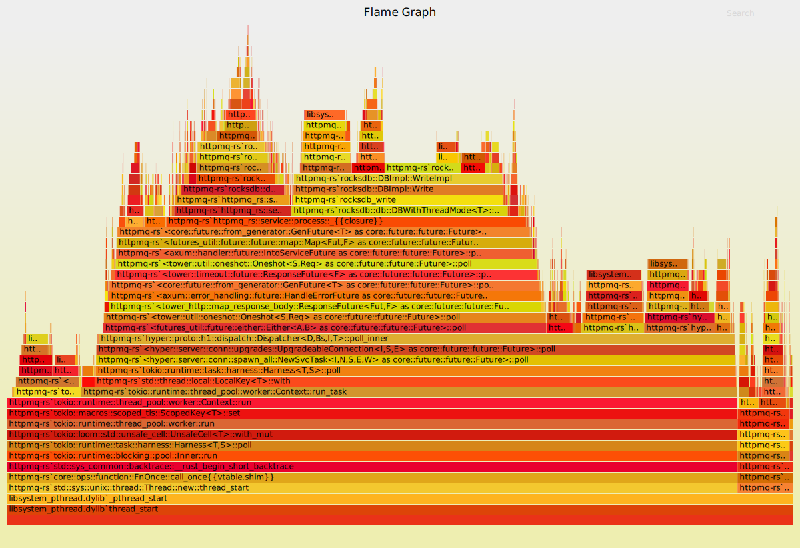
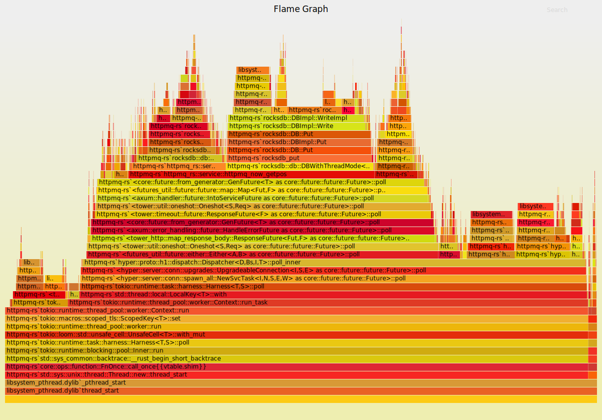

httpmq-rs
===

[](https://github.com/hnlq715/httpmq-rs/actions/workflows/rust.yml)

Benchmark
---

Also, you can refer to [github.com/hnlq715/httpmq#benchmark](https://github.com/hnlq715/httpmq#benchmark) for the benchmark of **Golang** implementation.

Test machine(Hackintosh):

```text
                    'c.          
                 ,xNMM.          ----------------------- 
               .OMMMMo           OS: macOS 11.6.1 20G224 x86_64 
               OMMM0,            Host: Hackintosh (SMBIOS: iMac20,1) 
     .;loddo:' loolloddol;.      Kernel: 20.6.0 
   cKMMMMMMMMMMNWMMMMMMMMMM0:    Uptime: 13 hours, 16 mins 
 .KMMMMMMMMMMMMMMMMMMMMMMMWd.    Packages: 45 (brew) 
 XMMMMMMMMMMMMMMMMMMMMMMMX.      Shell: zsh 5.8 
;MMMMMMMMMMMMMMMMMMMMMMMM:       Resolution: 1920x1080@2x 
:MMMMMMMMMMMMMMMMMMMMMMMM:       DE: Aqua 
.MMMMMMMMMMMMMMMMMMMMMMMMX.      WM: Quartz Compositor 
 kMMMMMMMMMMMMMMMMMMMMMMMMWd.    WM Theme: Blue (Dark) 
 .XMMMMMMMMMMMMMMMMMMMMMMMMMMk   Terminal: vscode 
  .XMMMMMMMMMMMMMMMMMMMMMMMMK.   CPU: Intel i5-10600K (12) @ 4.10GHz 
    kMMMMMMMMMMMMMMMMMMMMMMd     GPU: Radeon Pro W5500X 
     ;KMMMMMMMWXXWMMMMMMMk.      Memory: 17549MiB / 32768MiB 
       .cooc,.    .,coo:.
```

PUT

```bash
wrk -c 10 -t 2 -d 10s "http://127.0.0.1:1218/?name=xoyo&opt=put&data=aaaaaaaaaaaaaaaaaaaaaaaaaaaaaaaaaaaaaaaaaaaaaaaaaaaaaaaaaaaaaaaaaaaaaaaaaaaaaaaaaaaaaaaaaaaaaaaaaaaaaaaaaaaaaaaaaaaaaaaaaaaaaaaaaaaaaaaaaaaaaaaaaaaaaaaaaaaaaaaaaaaaaaaaaaaaaaaaaaaaaaaaaaaaaaaaaaaaaaaaaaaaaaaaaaaaaaaaaaaaaaaaaaaaaaaaaaaaaaaaaaaaaaaaaaaaaaaaaaaaaaaaaaaaaaaaaaaaaaaaaaaaaaaaaaaaaaaaaaaaaaaaaaaaaaaaaaaaaaaaaaaaaaaaaaaaaaaaaaaaaaaaaaaaaaaaaaaaaaaaaaaaaaaaaaaaaaaaaaaaaaaaaaaaaaaaaaaaaaaaaaaaaaaaaaaaaaaaaaaaaaaaaaaaaaaaaaaaaaaaaaaaaaaaaaaaaaaaaaaaaaaaaaaaaaaaaaaaaaaaaaaaaaaaaaaaaaaaaaaaaaaaaaaaaaaa"
Running 10s test @ http://127.0.0.1:1218/?name=xoyo&opt=put&data=aaaaaaaaaaaaaaaaaaaaaaaaaaaaaaaaaaaaaaaaaaaaaaaaaaaaaaaaaaaaaaaaaaaaaaaaaaaaaaaaaaaaaaaaaaaaaaaaaaaaaaaaaaaaaaaaaaaaaaaaaaaaaaaaaaaaaaaaaaaaaaaaaaaaaaaaaaaaaaaaaaaaaaaaaaaaaaaaaaaaaaaaaaaaaaaaaaaaaaaaaaaaaaaaaaaaaaaaaaaaaaaaaaaaaaaaaaaaaaaaaaaaaaaaaaaaaaaaaaaaaaaaaaaaaaaaaaaaaaaaaaaaaaaaaaaaaaaaaaaaaaaaaaaaaaaaaaaaaaaaaaaaaaaaaaaaaaaaaaaaaaaaaaaaaaaaaaaaaaaaaaaaaaaaaaaaaaaaaaaaaaaaaaaaaaaaaaaaaaaaaaaaaaaaaaaaaaaaaaaaaaaaaaaaaaaaaaaaaaaaaaaaaaaaaaaaaaaaaaaaaaaaaaaaaaaaaaaaaaaaaaaaaaaaaaaaaaaaaaaaaaaaaaaaaaaa
  2 threads and 10 connections
  Thread Stats   Avg      Stdev     Max   +/- Stdev
    Latency   138.55us  128.42us   8.36ms   99.35%
    Req/Sec    35.77k     1.68k   39.10k    79.70%
  719191 requests in 10.10s, 89.16MB read
Requests/sec:  71208.81
Transfer/sec:      8.83MB
```

GET

```bash
wrk -c 10 -t 2 -d 10s "http://127.0.0.1:1218/?name=xoyo&opt=get"
Running 10s test @ http://127.0.0.1:1218/?name=xoyo&opt=get
  2 threads and 10 connections
  Thread Stats   Avg      Stdev     Max   +/- Stdev
    Latency   124.17us   96.15us   5.12ms   99.45%
    Req/Sec    39.32k     2.11k   42.80k    82.18%
  790172 requests in 10.10s, 474.75MB read
Requests/sec:  78234.16
Transfer/sec:     47.00MB
```

Flamegraph
---

PUT



GET

